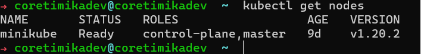

# Gimana sih caranya install kubernetes?

Untuk mulai belajar, sebelumnya kita harus *install* dulu kubernetesnya. (*Yakali ga diinstal...*).

Disini kita pake minikube (*yang gampang muehehehehehe...*)

**Install di Linux**:

*Copas* perintah ini ya... :point_down:

```
 curl -LO https://storage.googleapis.com/minikube/releases/latest/minikube-linux-amd64
 sudo install minikube-linux-amd64 /usr/local/bin/minikube
```

kalo sudah selesai sekarang jalankan minikube nya dengan perintah berikut

```
    minikube start
```

*terus tungguin dehhh....* :clock10: :soon:

cek minikube sudah bisa jalan di komputer atau belum
```
kubectl get nodes
```

Jika berhasil, dia akan muncul perintah seperti ini




**Install di Windows**:

Download aplikasinya disini Install Minikube! :point_right:
[Install Minikube](https://storage.googleapis.com/minikube/releases/latest/minikube-installer.exe) 

kalo sudah selesai sekarang jalankan minikube nya dengan perintah berikut

```
    minikube start
```

*terus tungguin dehhh....* :clock10: :soon:

cek minikube sudah bisa jalan di komputer atau belum
```
kubectl get nodes
```

Jika berhasil, dia akan muncul perintah seperti ini


**Install di MacOS**:

*Copas* perintah ini ya... :point_down:

```
 brew install minikube
```

kalo sudah selesai sekarang jalankan minikube nya dengan perintah berikut

```
    minikube start
```

*terus tungguin dehhh....* :clock10: :soon:

cek minikube sudah bisa jalan di komputer atau belum
```
kubectl get nodes
```

Jika berhasil, dia akan muncul perintah seperti ini


*TADAAA.... Kita sudah berhasil install Minikube di mesin kita* :fire: :+1: :sparkles: 🚀 🎺

## *Referensi*
> https://minikube.sigs.k8s.io/docs/start/
