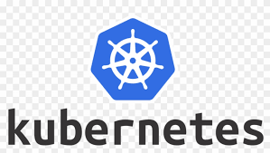

# sinau-kubernetes

Hai... disini saya sedang belajar kubernetes dari nol
sebisa mungkin saya akan update setiap hari (walau cuma 1-2 commit hehehe...).

Saya juga sedang coba membuat dokumentasi proses belajar saya sebaik mungkin. Jadi *feel free to drop* kritik dan saran di*issue* yaahhh... 

*Let's Learn Along* 💻 👓 🚀

## **Apasih Kubernetes?**

Kubernetes adalah platform atau sistem *opensource* yang berfungsi untuk men*deploy* (*auto deploy*), *scaling* aplikasi , *updates (rolling-update)*, mengatur dan me*manage* container-container yang berisi aplikasi atau *service*. Kubernetes awalnya diperkenalkan oleh **Google** pada tahun 2014.

 

**Traditional deployment era**

Awalnya, aplikasi-aplikasi dijalankan pada server fisik (bisa berupa komputer PC atau server). Karena dijalankan di sebuah perangkat, maka antar aplikasi-aplikasi tersebut saling *rebutan* *resource*. Contohnya, jika aplikasi A, B, C menjalankan perintah yang super berat di server salah satu aplikasi pasti akan kesulitan untuk mengeksekusi tugasnya karena *resource*-nya sudah dipakai oleh 2 aplikasi sebelumnya. Solusinya adalah masing-masing aplikasi dijalankan pada server yang berbeda. Tentunya hal ini malah bikin mahal kan? 🤔 💸

 

**Virtualized deployment era**

Nah... atas problem tersebut, kemudian *virtualization* diperkenalkan. Hal ini memungkinkan kita dapat menjalankan banyak Virtual Mesin (**VM**) pada satu server. *Virtualization* juga dapat memisah-misahkan berbagai aplikasi dari **VM** yang lainnya sehingga **VM** yang lain tidak bisa mengakses aplikasi yang berada di **VM** yang berbeda.

 

**Container deployment era**

Kemudian muncul lagi yang namanya *container*. Sebenarnya *container* hampir mirip dengan **VM**, tapi *container* lebih ringan dan dia terpisah dengan sistem hostnya (server). *Container* punya banyak keunggulan dibanding **VM**:
- Mudah untuk dibuat dan dideploy dibanding **VM**
- Kita tidak perlu repot untuk setting config / install dependensi untuk menjalankan aplikasi saat deployment
- *Environment* nya bisa konsisten antara *testing, development, production* bisa dibuat semirip mungkin (Karena memang file Image sama)
- Bisa dijalankan dimana aja di OS server mana saja.

 

**Terus... Kenapa Harus Kubernetes? 🤔**

Nah... *container* ini harus ada yg *memanage* biar dia ga ada *downtime* dan aplikasi-aplikasi kita bisa jalan dengan lancar dan sesuai dengan tujuannya. Kubernetes bisa:
- ***Service discovery and load balancing*** dia bisa *expose* *container* kita ke *public IP* dan bisa *nge-bagi* *traffic network* ke *container-container* supaya aplikasi kita dapat berjalan dengan stabil
- ***Storage orchestration*** penyimpanan yang dipakai bisa flexible antara *local, cloud* atau yang lainnya
- ***Automated rollouts and rollbacks*** Kalau aplikasi kita ada update, dia bisa otomatis *deploy* sendiri. Atau kalau ada kesalahan di-*deployment* dia bisa *rollback*. Seru kan??? 🙌
- ***Self-healing*** kalo ada *container* atau aplikasi kamu yang rusak atau malfungsi, tenang... kubernetes bisa otomatis bikinin kita container baru lagi yang setting dan konfig nya sama... 🙌 terus jalan lagi deh aplikasi kita 🚀
- ***Auto Scaling*** Kubernetes bisa otomatis nambahin *container* kalo aplikasi kita lagi sibuk banget dan butuh *resource* yang gede.

### **Referensi**
> https://kubernetes.io/docs/concepts/overview/what-is-kubernetes/

> https://kubernetes.io/

> https://blog.risingstack.com/the-history-of-kubernetes/

## **Daftar Isi**

>**Pre Face**
>
> Install Minikube!
>[Install Minikube](https://github.com/christianmahardhika/sinau-kubernetes/tree/main/0-Install-Minikube)
>
> Kubernetes Architecture!
>[Kubernetes Architecture](https://github.com/christianmahardhika/sinau-kubernetes/tree/main/0-Install-Minikube)

**Basic Kubernetes**